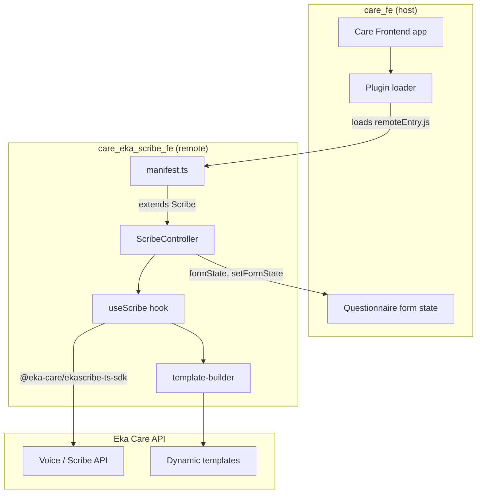
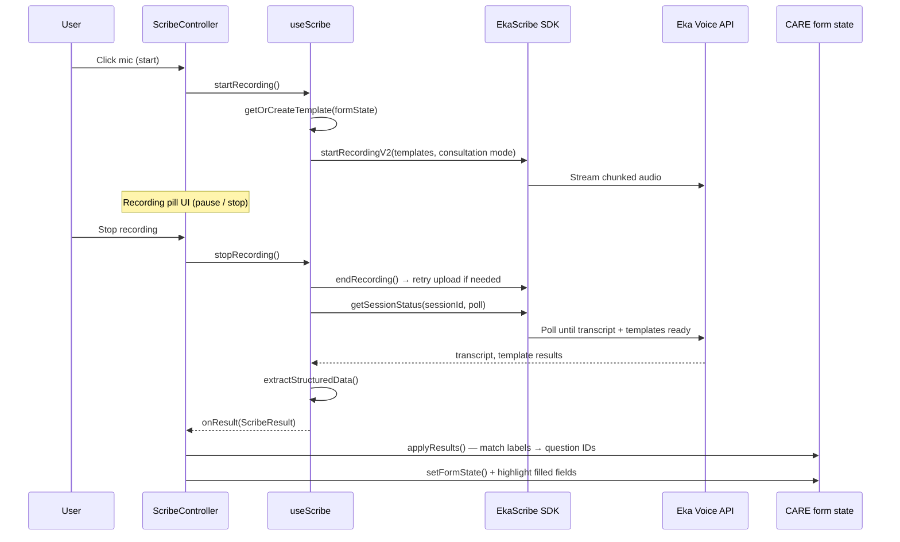

# How care_eka_scribe_fe Works

`care_eka_scribe_fe` is a **Care Frontend plugin** that adds AI-powered clinical documentation (EkaScribe) to OHCN's EMR. It runs as a **module federation remote** inside [care_fe](https://github.com/ohcnetwork/care_fe) and extends the host application with a floating **Scribe** component that records consultations and auto-fills questionnaire forms.

---

## High-Level Architecture



| Layer                  | Role                                                                          |
| ---------------------- | ----------------------------------------------------------------------------- |
| **care_fe**            | Host app; loads plugins, renders extended components, owns form state         |
| **care_eka_scribe_fe** | Remote microfrontend; exposes manifest + Scribe UI                            |
| **EkaScribe SDK**      | Handles mic capture, chunked upload, transcription, and structured extraction |

---

## Plugin Integration (Module Federation)

The plugin is built with [Vite Module Federation](https://github.com/originjs/vite-plugin-federation) (`@originjs/vite-plugin-federation`).

### What gets exposed

`vite.config.mts` exposes a single entry:

```ts
exposes: {
  "./manifest": "./src/manifest.ts",
}
```

`care_fe` fetches `remoteEntry.js` from the plugin's preview/build server and imports the manifest. Shared dependencies (`react`, `react-dom`, `react-i18next`, `@tanstack/react-query`, `raviger`) are deduplicated with the host.

### Manifest contract

`src/manifest.ts` tells care_fe how to integrate the plugin:

```ts
{
  plugin: "care-eka-scribe-fe",
  routes: {},                    // no standalone routes yet
  extends: ["Scribe"],           // extends the host's Scribe slot
  components: {
    Scribe: ScribeController,    // lazy-loaded React component
  },
  devices: [],
}
```

- **`extends`** — names a host extension point. care_fe renders `ScribeController` wherever it provides a `Scribe` slot (typically on questionnaire/encounter forms).
- **`components.Scribe`** — receives props from the host, including `formState` and `setFormState`.

### Entry point

`src/index.tsx` re-exports `manifest`, `routes`, and `ScribeController` for standalone builds. It also reads `window.CARE_API_URL` set by the host for any future Care API calls.

---

## Core Feature: AI Scribe

The Scribe records a clinical consultation, sends audio to Eka Care, and returns:

1. A **transcript** of the conversation
2. **Structured data** keyed by form field labels (vitals, notes, etc.)

That structured data is matched back to CARE questionnaire fields and written into the form automatically.

### End-to-end flow



### Recording lifecycle (`ScribeStatus`)

| Status       | Meaning                                           |
| ------------ | ------------------------------------------------- |
| `idle`       | Mic FAB visible; ready to start                   |
| `recording`  | Audio capture active; timer running               |
| `paused`     | Capture paused; can resume or stop                |
| `processing` | Upload finished; waiting for transcript/templates |
| `completed`  | Results ready; form fields may be filled          |
| `failed`     | Error during start, upload, or polling            |

---

## Key Modules

### `useScribe` (`src/hooks/useScribe.ts`)

Central hook wrapping `@eka-care/ekascribe-ts-sdk`.

**Responsibilities:**

- Lazily initialize a singleton EkaScribe instance (with a shared worker blob URL)
- Register SDK callbacks: `onTokenRequired`, `onError`, `onUploadEvent`, `onRecordingStateChange`
- Manage recording state, duration timer, and session ID
- On stop: end recording → poll session status → parse templates → emit `ScribeResult`
- `extractStructuredData()` — normalizes template JSON into `Record<string, string>` for form matching

**Configuration** (baked in at build time via `.env`):

| Variable                 | Purpose                                                                                                                                 |
| ------------------------ | --------------------------------------------------------------------------------------------------------------------------------------- |
| `REACT_EKA_ACCESS_TOKEN` | Long-lived token from [console.dev.eka.care](https://console.dev.eka.care) (DEV) or [console.eka.care](https://console.eka.care) (PROD) |
| `REACT_EKA_ENV`          | `DEV` → `api.dev.eka.care`; `PROD` → `api.eka.care`                                                                                     |

> **Important:** Token and environment must match. A PROD token with `REACT_EKA_ENV=DEV` causes 403/CORS errors in the browser. When running inside care_fe, CORS is checked against the **host page origin** (e.g. `http://localhost:4000`), not the plugin's `:10122` preview URL.

### `template-builder` (`src/lib/template-builder.ts`)

Before recording, the plugin builds an EkaScribe **template** tailored to the current questionnaire:

1. **`extractFormFields(formState)`** — walks questionnaire groups, collects fillable fields (skips `group`, `structured`, `date`, `dateTime`)
2. **`buildTemplateDescription(fields)`** — generates a prompt instructing the model to return JSON with keys matching field labels
3. **`getOrCreateTemplate(formState, ekascribe)`** — creates section + template via SDK, or reuses a cached template ID from `localStorage` (keyed by questionnaire slug, 7-day TTL)

If template creation fails or no fields are found, it falls back to `clinical_notes_template`.

### `ScribeController` (`src/components/scribe/ScribeController.tsx`)

Main UI component mounted by care_fe. Props from the host:

| Prop           | Type           | Purpose                                                                       |
| -------------- | -------------- | ----------------------------------------------------------------------------- |
| `formState`    | `unknown`      | CARE questionnaire state (array of groups with `questionnaire` + `responses`) |
| `setFormState` | `(fn) => void` | Host setter to update form responses                                          |

**UI states:**

- **Idle** — fixed mic FAB (bottom-right)
- **Compact pill** — status dot, timer, pause/stop controls, live transcript preview
- **Expanded panel** — full transcript + extracted values + dismiss

**Form auto-fill (`applyResults`):**

1. Iterate groups → questions → responses
2. Skip structured/complex types (symptoms, medications, dates)
3. **`matchVitalToQuestion(questionText, structuredData)`** — fuzzy label matching (normalized strings; special handling for blood pressure systolic/diastolic)
4. **`toResponseValue(value, questionType)`** — coerce to CARE response shape (`number`, `boolean`, `string`, etc.)
5. Call `setFormState` once with all updates
6. **`highlightFilledFields`** — scroll to and briefly highlight each filled `question-{id}` element in the DOM

### Supporting components

| Component        | Status                                                             |
| ---------------- | ------------------------------------------------------------------ |
| `RecordingPanel` | Standalone recording UI (not used by `ScribeController` currently) |
| `ResultPanel`    | Standalone results/review UI with apply-per-field actions          |
| `ScribeButton`   | Styled mic button variant                                          |

`ScribeController` implements its own compact/expanded UI inline rather than composing these panels.

---

## Data Shapes

### `ScribeResult` (`src/lib/types/scribe.ts`)

```ts
{
  transcript?: string;
  templates?: Record<string, unknown>[];
  structuredData?: Record<string, unknown>;  // label → value for form fill
}
```

### CARE `formState` (expected shape)

An array of group objects, each containing:

```ts
{
  questionnaire: {
    slug?: string;
    title?: string;
    questions: Question[];   // nested for groups
  };
  responses: Array<{
    question_id: string;
    values?: Array<{ type: string; value: unknown }>;
    structured_type?: string;
  }>;
}
```

---

## Development

### Prerequisites

- Node.js ≥ 22.9.0
- A running **care_fe** instance configured to load this plugin
- EkaScribe access token (see `.env.example`)

### Setup

```bash
cp .env.example .env
# Edit .env with REACT_EKA_ACCESS_TOKEN and REACT_EKA_ENV

npm install
npm start
```

`npm start` runs two processes concurrently:

| Script        | What it does                                            |
| ------------- | ------------------------------------------------------- |
| `build:watch` | Nodemon watches `src/` and runs `vite build` on changes |
| `preview`     | Serves built assets on **port 10122** with CORS enabled |

Rebuild after changing `.env` — Vite bakes `REACT_*` variables at build time.

### care_fe registration

The plugin is registered in care_fe via `care-package.lock`:

```json
{
  "package": "ohcnetwork/care_eka_scribe_fe_fe",
  "branch": "main"
}
```

care_fe resolves this package, loads `remoteEntry.js`, and mounts `ScribeController` on forms that expose the `Scribe` extension point.

---

## Project Structure

```
src/
├── manifest.ts              # Plugin manifest (routes, extends, components)
├── routes.tsx               # Empty routes (reserved for future pages)
├── index.tsx                # Federation entry + exports
├── hooks/
│   └── useScribe.ts         # EkaScribe SDK integration
├── components/
│   └── scribe/
│       ├── ScribeController.tsx   # Main UI + form auto-fill
│       ├── RecordingPanel.tsx
│       ├── ResultPanel.tsx
│       └── ScribeButton.tsx
└── lib/
    ├── template-builder.ts  # Dynamic EkaScribe template creation
    ├── types/scribe.ts
    └── request.ts           # Care API HTTP helpers (for future use)
```

---

## Error Handling & Edge Cases

- **Audio upload failure** — `stopRecording` retries via `retryUploadRecording()` before failing
- **Token refresh** — SDK `onTokenRequired` callback can call `onTokenRefresh` prop (not wired in `ScribeController` yet; uses env token)
- **Template cache invalidation** — cache misses when field count changes for the same questionnaire slug
- **No fillable fields** — falls back to `clinical_notes_template`; only transcript is produced
- **PROD token in DEV** — `warnIfTokenEnvMismatch()` logs a console warning at init

---

## Summary

1. **care_fe** loads this plugin as a federated remote and renders `ScribeController` on questionnaire forms.
2. The user records a consultation; audio goes to **Eka Care** via the **EkaScribe SDK**.
3. A **dynamic template** (built from the current form's fields) instructs the AI what JSON to return.
4. Extracted values are **fuzzy-matched** to question labels and written into CARE form responses.
5. Filled fields are **highlighted and scrolled into view** for clinician review.

The plugin does not define its own routes or pages today — it is a focused **Scribe extension** for the Care EMR workflow.
